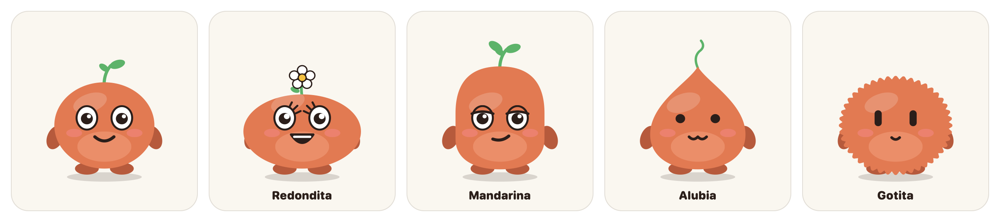
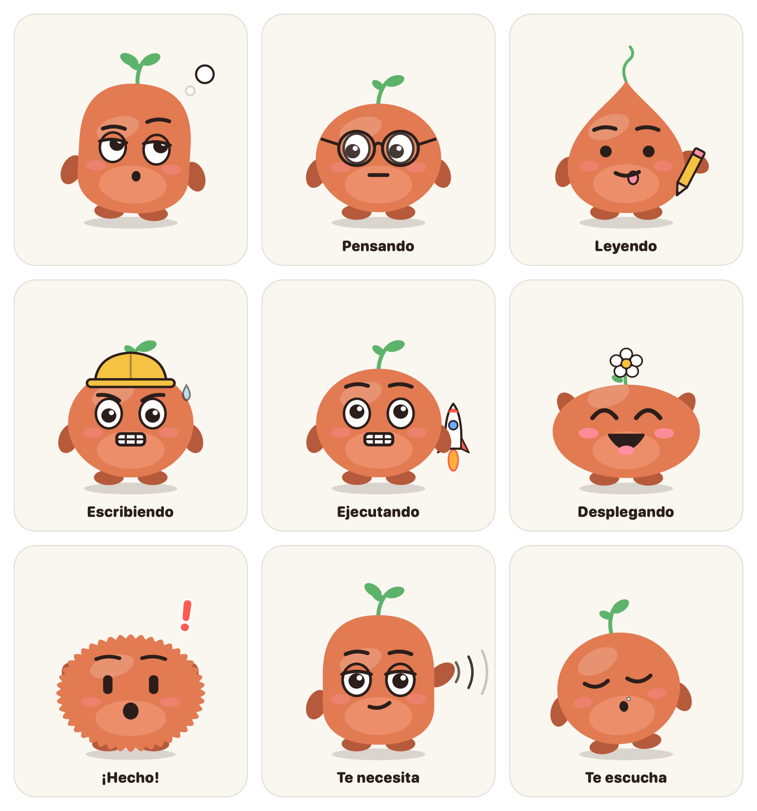
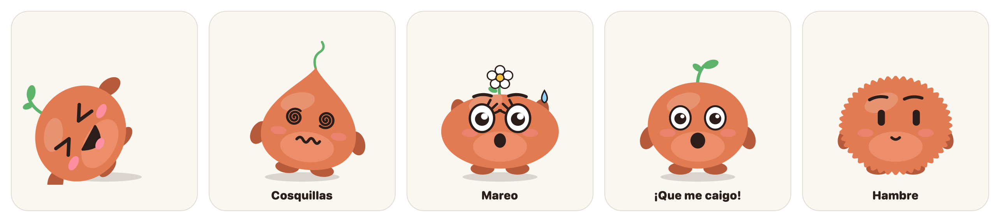
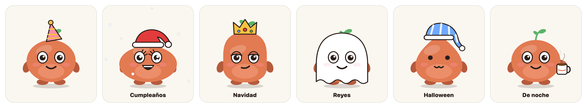
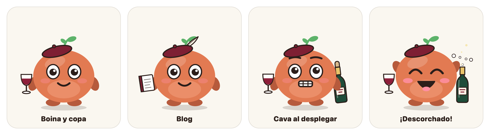

# Carita

<p align="center"></p>

<p align="center"><b>Un bichito naranja que flota en tu Mac y pone cara a lo que hace Claude Code.</b><br>
Te lee las respuestas, le puedes hablar, te avisa cuando te necesita y, cuando hay varios sin nada que hacer, se sientan juntos en un sofá.</p>

<p align="center"><a href="https://github.com/isrart/carita/releases/latest"><b>⬇️ Descargar la última versión</b></a> · macOS 13 o superior · todo se queda en tu Mac · <a href="README.md">English</a></p>

<p align="center"></p>

## Qué hace

| Claude Code está…            | Carita…                                   |
|------------------------------|-------------------------------------------|
| empezando una sesión         | te saluda con la manita                   |
| pensando                     | mira al techo y le da vueltas a la hoja   |
| leyendo archivos             | se pone las gafas                         |
| escribiendo código           | saca la lengua y garabatea con el lápiz   |
| ejecutando comandos          | casco de obra, dientes apretados, sudando |
| buscando en internet         | lupa en mano                              |
| lanzando subagentes          | aparecen dos mini-colegas                 |
| desplegando (`git push`, `deploy`, `vercel --prod`…) | cohete en la plataforma; si sale bien, despega con fuegos artificiales |
| esperando que decidas algo   | salta, agita los brazos y, si estás en otra app, cruza la pantalla para buscarte |
| terminado                    | confeti, y te lee en voz alta un resumen de la respuesta |

Los ojos siguen al ratón, parpadea y, si no hay novedades, se aburre, se duerme (con pompa de moco) y se queda quieto para no gastar batería.

## Un bicho por sesión

Cada sesión de Claude Code que tengas abierta tiene su propio bicho, con su nombre debajo (el que le pongas con `/rename`, o el de la carpeta). Cada uno reacciona a lo suyo; cuando una sesión termina, su bicho se despide y se va.

<p align="center"></p>

Cuando hay dos o más sin nada que hacer, en vez de quedarse sueltos por la pantalla se van a un **sofá** y se sientan juntos. El que tiene trabajo se levanta, y vuelve cuando acaba.

## Cinco Caritas

Siempre naranja, como Claude, pero con cinco formas, cada una con su cara: **redondita**, **alubia** (más seria), **gotita** (ojos de punto y boca de gato), **mandarina con flor** y **pelusita** (como la mascota de Claude Code). Sale una u otra según el proyecto:

| Si la carpeta contiene… | Forma |
|---|---|
| claude, agent, mcp, skill, prompt | pelusita |
| blog, reel, insta, video, redes, social | mandarina con flor |
| app, api, swift, ios, web, code, dev… | alubia |
| notas, apuntes, scratch, prueba, test, tmp | gotita |
| lo demás | redondita |

Las reglas se cambian en Ajustes → Aspecto. También puedes escribir la forma en un archivo `.carita` en la raíz del proyecto (por ejemplo, `alubia`).

## Háblale

**Mantén pulsado `⌃⌥⌘Espacio`** mientras hablas, como un walkie-talkie. El bicho de la sesión que estuvo activa la última se lleva la mano a la oreja y va escribiendo lo que entiende. Al soltar, lo deja escrito en la terminal de esa sesión para que lo revises y lo envíes tú (o, si lo prefieres, lo envía directamente: Ajustes → Voz).

El reconocimiento de voz funciona en tu Mac, sin internet. La primera vez pide permiso para el micrófono y el reconocimiento de voz; para escribir en la terminal necesita además **Accesibilidad** (Ajustes del Sistema → Privacidad y seguridad → Accesibilidad → Carita). En Terminal elige la pestaña exacta de la sesión; en otras terminales trae la app al frente.

## Te lee las respuestas

Cuando Claude termina, Carita te dice en voz alta la idea general (sin código, tablas ni rutas largas) y pone la frase principal en el bocadillo. Para callarla, haz clic encima. Se desactiva en Ajustes → Voz, donde también eliges la voz, la velocidad y el tono. Si la voz suena robótica, descarga una «mejorada» o «prémium» en Ajustes del Sistema → Accesibilidad → Contenido leído.

## Sorpresas

<p align="center"></p>

- **Cosquillas**: 8 clics rápidos y se cae de espaldas muerto de risa.
- **Mareo**: zarandéalo arrastrándolo de lado a lado.
- **«¡Que me caigo!»**: llévalo al borde de la pantalla.
- **Hambre**: deja el puntero quieto encima un rato… y ¡ñam! (es broma).
- **Escondite**: clic derecho → «Jugar al escondite». Se asoma por un borde de la pantalla; si lo pillas, te dice cuánto has tardado.

## Días y horas especiales

<p align="center"></p>

Gorro de fiesta en los cumpleaños que apuntes en Ajustes (y te canta «Cumpleaños feliz»), Papá Noel con nieve en Navidad, corona en Reyes, fantasma en Halloween y un disfraz distinto cada hora en Carnaval. De 22:00 a 7:00 se pone el pijama, y de 7:00 a 8:30 tiene su taza de café.

## Y además

- **Descansos**: tras 90 minutos seguidos de trabajo te pide que te estires; si lo ignoras, se pone un antifaz.
- **No molesta en las llamadas**: si enciendes la cámara o compartes pantalla (Zoom, Compartir pantalla, AirPlay), se esconde y se calla; luego vuelve sola.
- **Estadísticas**: horas por proyecto, tareas terminadas, deploys y descansos de la semana o del mes.
- **Diagnóstico**: si no reacciona, te dice qué falla y lo arregla («Reinstalar hooks»).
- **Se actualiza sola** con un clic (Más → Buscar actualizaciones).

## Instalar

### Ya compilada (lo más fácil)

1. Descarga **Carita.zip** de la [última Release](https://github.com/isrart/carita/releases/latest), descomprímelo y mueve **Carita.app** a `~/Applications` (o a Aplicaciones).
2. **La primera vez, clic derecho → Abrir → Abrir.** La app va firmada con un certificado propio, no con uno de Apple, así que macOS avisa de que no puede comprobarla. Si no te deja abrirla:
   ```bash
   xattr -dr com.apple.quarantine ~/Applications/Carita.app
   ```
3. Icono del bichito en la barra de menús → **Más → Diagnóstico… → Reinstalar hooks**. Conecta Carita con Claude Code sin tocar el resto de tu `~/.claude/settings.json`.
4. Abre una sesión **nueva** de Claude Code.

Hace falta `python3`, que viene con las Command Line Tools (`xcode-select --install`).

### Desde el código

```bash
git clone https://github.com/isrart/carita.git
cd carita
bash install.sh
```

Compila la app, la deja en `~/Applications`, conecta los hooks (guardando una copia de tu `settings.json`) y la abre.

## Usar

- **Arrastra** a los bichos donde quieras; recuerdan el sitio.
- **Clic**: cosquillas. Si está hablando, se calla. Si te necesita, te lleva a la terminal.
- **Menú** (clic derecho o el icono de la barra de menús): ocultar, silenciar 1 hora, escondite, «Más» (estadísticas, diagnóstico, actualizaciones) y **Ajustes**.
- **Atajos**: `⌃⌥⌘C` esconde o muestra, `⌃⌥⌘M` la calla una hora y `⌃⌥⌘Espacio` (mantenido) para hablarle. Se cambian en Ajustes → Atajos.

## Personalizar

- **Ajustes**: tu nombre, idioma (español o inglés), tamaño, voz, descansos, forma, cumpleaños, no molestar y atajos. Todo se guarda en `~/.carita/config.json` y se aplica al momento.
- **Frases**: Ajustes → General → «Editar frases…» crea `~/.carita/frases.json` con todas las de serie. Cada estado que pongas sustituye a sus frases; con `"+done"` añades en vez de sustituir. `{n}` es tu nombre.

## Cómo funciona

```
Claude Code ──hooks──▶ ~/.carita/hook.sh ──▶ ~/.carita/sesiones/<sesión>.state ──▶ Carita.app ──▶ un bicho por sesión
```

Los hooks de Claude Code solo escriben una palabra en un archivo (y, al terminar, un resumen de la respuesta). La app vigila esa carpeta y cambia la cara. **Nada sale de tu Mac**, salvo la consulta a GitHub para buscar actualizaciones, que puedes desactivar.

## Pack Bajovelo

<p align="center"></p>

Carita nació para Bajovelo, un proyecto sobre vino, y trae un pack opcional con su estilo: boina granate siempre y, en la mano, algo según el subproyecto (copa de vino, cuaderno para el blog, guía, cartel de trivia o móvil grabando). Los deploys se celebran agitando una botella de cava y descorchándola. Se activa en Ajustes → Aspecto → «Pack Bajovelo», donde también se cambian las palabras de cada disfraz.

## Desinstalar

```bash
bash uninstall.sh
```

Quita la app, sus hooks (el resto de tu `settings.json` se queda como estaba) y `~/.carita`.

---

Para desarrollo: [`CLAUDE.md`](CLAUDE.md) explica cómo está montada y [`ROADMAP.md`](ROADMAP.md) recoge cómo se hizo.
