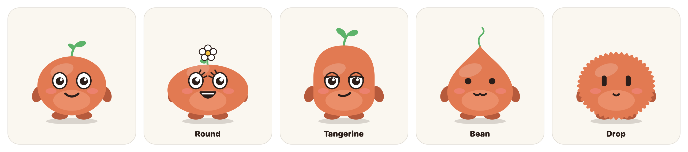
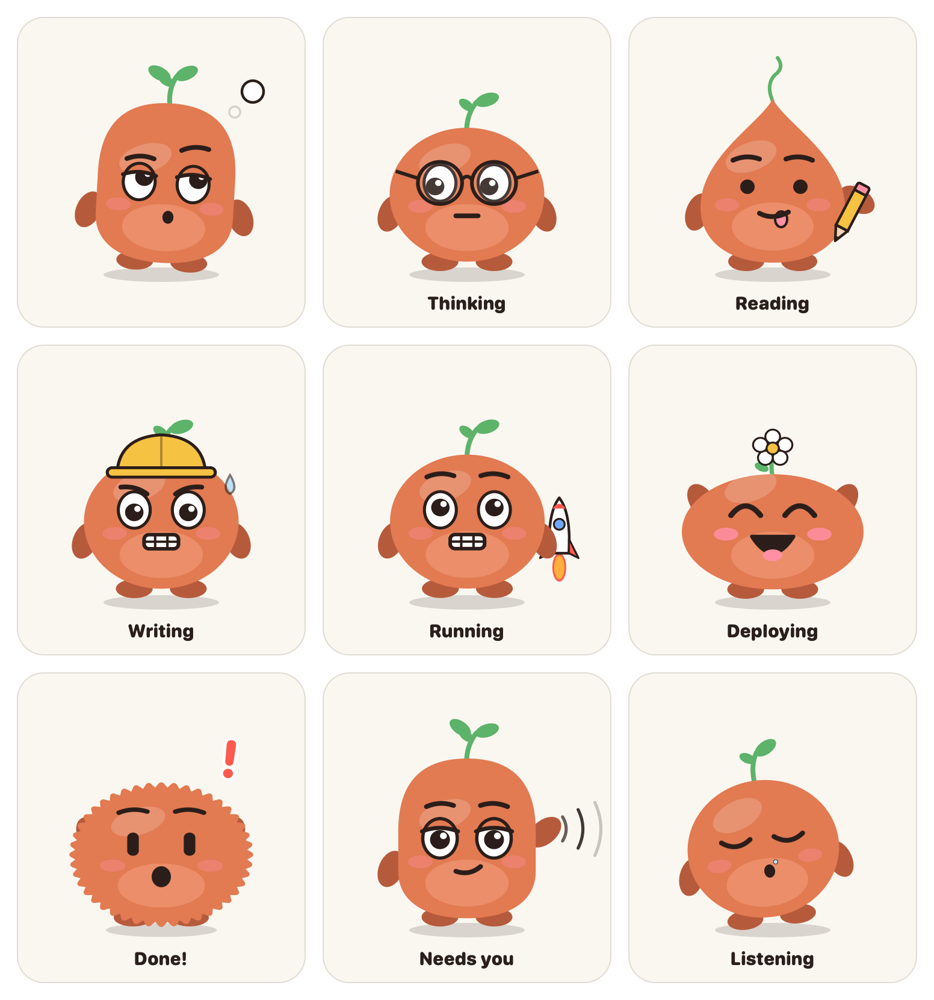
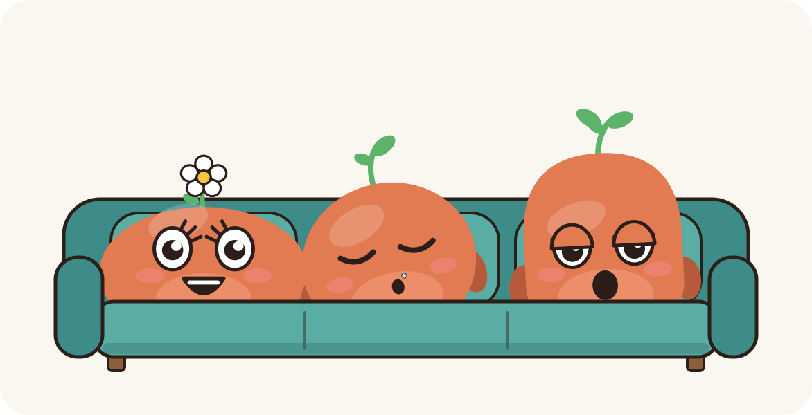
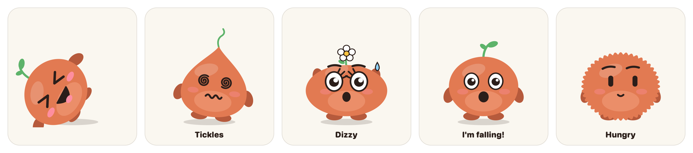
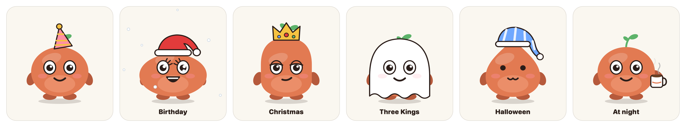
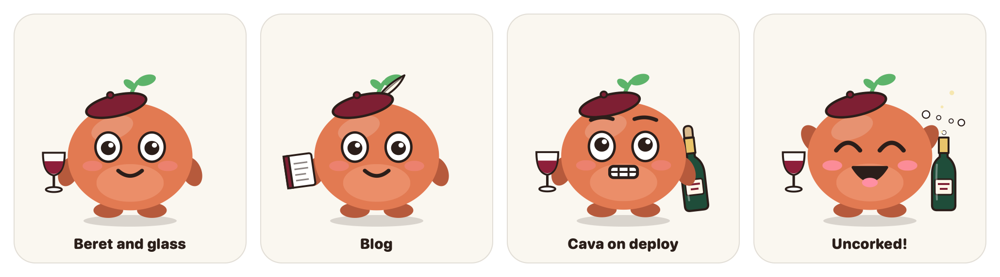

# Carita

<p align="center"></p>

<p align="center"><b>A little orange critter that floats on your Mac and puts a face on what Claude Code is doing.</b><br>
It reads answers out loud, you can talk to it, it lets you know when it needs you and, when several of them have nothing to do, they sit together on a sofa.</p>

<p align="center"><a href="https://github.com/isrart/carita/releases/latest"><b>⬇️ Download the latest version</b></a> · macOS 13 or later · everything stays on your Mac · <a href="README.es.md">Español</a></p>

<p align="center"></p>

## What it does

| Claude Code is…              | Carita…                                    |
|------------------------------|--------------------------------------------|
| starting a session           | waves hello                                |
| thinking                     | looks up and twirls its leaf               |
| reading files                | puts its glasses on                        |
| writing code                 | sticks its tongue out and scribbles        |
| running commands             | hard hat, gritted teeth, sweating          |
| browsing the web             | magnifying glass in hand                   |
| launching subagents          | two mini-buddies show up                   |
| deploying (`git push`, `deploy`, `vercel --prod`…) | a rocket on the launch pad; if it works, liftoff and fireworks |
| waiting for your decision    | jumps, waves its arms and, if you're in another app, runs across the screen to find you |
| done                         | confetti, and it reads you a summary of the answer |

Its eyes follow the mouse, it blinks and, when nothing happens, it gets bored, falls asleep (snot bubble included) and stays still to save battery.

## One critter per session

Every open Claude Code session gets its own critter, with its name underneath (whatever you set with `/rename`, or the folder name). Each one reacts to its own session; when a session ends, its critter says goodbye and leaves.

<p align="center"></p>

When two or more have nothing to do, instead of hanging around the screen they walk to a **sofa** and sit together. The one with work to do gets up, and comes back when it's done.

## Five Caritas

Always orange, like Claude, but in five shapes, each with its own face: **round**, **tall bean** (more serious), **little drop** (dot eyes and a cat mouth), **tangerine with a flower** and **fluffball** (like Claude Code's mascot). Which one shows up depends on the project:

| If the folder contains… | Shape |
|---|---|
| claude, agent, mcp, skill, prompt | fluffball |
| blog, reel, insta, video, social | tangerine with a flower |
| app, api, swift, ios, web, code, dev… | tall bean |
| notes, scratch, test, tmp, sandbox | little drop |
| anything else | round |

Change the rules in Settings → Look, or write the shape in a `.carita` file at the project root (e.g. `alubia` for the bean).

## Talk to it

**Hold `⌃⌥⌘Space`** while you speak, like a walkie-talkie. The critter of the most recently active session cups its ear and types what it hears. When you let go, it types it into that session's terminal for you to check and send (or sends it right away, if you prefer: Settings → Voice).

Speech recognition runs on your Mac, offline. The first time it asks for microphone and speech recognition permission; to type into the terminal it also needs **Accessibility** (System Settings → Privacy & Security → Accessibility → Carita). In Terminal it picks the session's exact tab; in other terminals it brings the app to the front.

## It reads answers out loud

When Claude finishes, Carita tells you the gist out loud (no code, tables or long paths) and puts the main sentence in its speech bubble. Click it to make it stop. Turn it off in Settings → Voice, where you also pick the voice, speed and pitch. If the voice sounds robotic, download an "Enhanced" or "Premium" one in System Settings → Accessibility → Spoken Content.

## Surprises

<p align="center"></p>

- **Tickles**: 8 quick clicks and it falls on its back laughing.
- **Dizzy**: shake it by dragging it from side to side.
- **"I'm falling!"**: drag it to the edge of the screen.
- **Hungry**: leave the pointer still on top of it for a while… and chomp! (just kidding).
- **Hide and seek**: right-click → "Play hide and seek". It peeks out from an edge of the screen; find it and it tells you how long you took.

## Special days and hours

<p align="center"></p>

A party hat on the birthdays you add in Settings (and it sings "Happy birthday"), a Santa hat with snow at Christmas, a crown on Three Kings' Day, a ghost on Halloween and a different costume every hour during Carnival. From 10 pm to 7 am it wears pajamas, and from 7 to 8:30 am it has its coffee.

## And also

- **Breaks**: after 90 minutes of non-stop work it asks you to stretch; ignore it and it puts on a sleep mask.
- **No interruptions on calls**: when your camera is on or you share your screen (Zoom, Screen Sharing, AirPlay), it hides and goes quiet, then comes back by itself.
- **Statistics**: hours per project, finished tasks, deploys and breaks for the week or month.
- **Diagnostics**: if it doesn't react, it tells you what's wrong and fixes it ("Reinstall hooks").
- **One-click updates** (More → Check for updates).

## Install

### Prebuilt (easiest)

1. Download **Carita.zip** from the [latest release](https://github.com/isrart/carita/releases/latest), unzip it and move **Carita.app** to `~/Applications` (or Applications).
2. **The first time, right-click → Open → Open.** The app is signed with its own certificate, not an Apple one, so macOS warns that it can't verify it. If it still won't open:
   ```bash
   xattr -dr com.apple.quarantine ~/Applications/Carita.app
   ```
3. Critter icon in the menu bar → **More → Diagnostics… → Reinstall hooks**. This connects Carita to Claude Code without touching the rest of your `~/.claude/settings.json`.
4. Open a **new** Claude Code session.

`python3` is required; it comes with the Command Line Tools (`xcode-select --install`).

### From source

```bash
git clone https://github.com/isrart/carita.git
cd carita
bash install.sh
```

It builds the app, puts it in `~/Applications`, connects the hooks (keeping a backup of your `settings.json`) and opens it.

## Usage

- **Drag** the critters anywhere; they remember their spot.
- **Click**: tickles. If it's talking, it stops. If it needs you, it takes you to the terminal.
- **Menu** (right-click or the menu bar icon): hide, mute for 1 hour, hide and seek, "More" (statistics, diagnostics, updates) and **Settings**.
- **Shortcuts**: `⌃⌥⌘C` hides or shows it, `⌃⌥⌘M` mutes it for an hour and `⌃⌥⌘Space` (held) to talk. Change them in Settings → Shortcuts.

## Customize

- **Settings**: your name, language (English or Spanish), size, voice, breaks, shape, birthdays, do not disturb and shortcuts. Everything is saved in `~/.carita/config.json` and applies instantly.
- **Lines**: Settings → General → "Edit lines…" creates `~/.carita/frases.json` with all the built-in lines. Each state you add replaces its lines; with `"+done"` you add instead of replacing. `{n}` is your name.

## How it works

```
Claude Code ──hooks──▶ ~/.carita/hook.sh ──▶ ~/.carita/sesiones/<session>.state ──▶ Carita.app ──▶ one critter per session
```

Claude Code's hooks just write a word to a file (and, when done, a summary of the answer). The app watches that folder and changes the face. **Nothing leaves your Mac**, except the GitHub check for updates, which you can turn off.

## Bajovelo pack

<p align="center"></p>

Carita was born for Bajovelo, a Spanish wine project, and ships an optional pack in its style: a maroon beret and, in hand, something for each subproject (a wine glass, a notebook for the blog, a guide, a trivia sign or a phone recording). Deploys are celebrated by shaking a bottle of cava and popping the cork. Turn it on in Settings → Look → "Bajovelo pack", where you can also change the words for each costume.

## Uninstall

```bash
bash uninstall.sh
```

Removes the app, its hooks (the rest of your `settings.json` stays as it was) and `~/.carita`.

---

For development: [`CLAUDE.md`](CLAUDE.md) explains how it's built (in Spanish) and [`ROADMAP.md`](ROADMAP.md) records how it was made.
